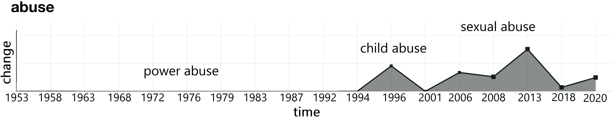

# WiDiD: What is Done is Done
This is the official repository for our paper **Studying Word Meaning Evolution through Incremental Semantic Shift Detection: A Case Study of Italian Parliamentary Speeches**


## Overview
This repository contains the code and data used to implement and evaluate WiDiD, as well as the code for analyzing and visualizing semantic shifts in a given corpus.

WiDiD is an incremental approach to Semantic Shift Detection, designed for tracing the evolution of word meanings over time in a diachronic corpus.

<p align="center">

</p>
<p align="center">
Figure: An example of semantic shift in the word _abuse_ over time.
</p>

## Table of Contents

- [Introduction](#introduction)
- [Getting Started](#getting-started)
- [Usage](#usage)
- [Contributing](#contributing)
- [License](#license)

## Introduction

Words are malleable, and their meanings continuously evolve due to various factors such as social practices, events, and political circumstances. Understanding these semantic shifts is essential for linguists, historians, and lexicographers. The WiDiD approach provides a computational method for capturing these changes and analyzing the evolution of individual word senses.

## Getting Started

### Prerequisites

Before you begin, ensure you have met the following requirements:

- Python 3.7+
- Required Python packages (listed in `requirements.txt`)

To install the required packages, you can use pip:

```bash
pip install -r requirements.txt


## Evaluation
<b> Download data </b>
```
bash sbatch/semeval-english-download.sh datasets
bash sbatch/semeval-swedish-download.sh datasets
bash sbatch/semeval-latin-download.sh datasets
bash sbatch/semeval-german-download.sh datasets
bash sbatch/rushifteval-russian-download.sh datasets tokenization
bash sbatch/diacrita-italian-download.sh datasets
bash sbatch/lscdiscovery-spanish-download.sh datasets
```
<b> Tokenization </b>
```
bash sbatch/semeval-english-tokenization.sh datasets tokenization
bash sbatch/semeval-german-tokenization.sh datasets tokenization
bash sbatch/semeval-latin-tokenization.sh datasets tokenization
bash sbatch/semeval-swedish-tokenization.sh datasets tokenization
bash sbatch/diacrita-italian-tokenization.sh datasets tokenization
bash sbatch/lsdiscovery-spanish-tokenization.sh datasets tokenization
```
<b> Embedding extraction </b>
```
bash sbatch/semeval-english-extraction.sh tokenization embeddings datasets
bash sbatch/semeval-german-extraction.sh tokenization embeddings datasets
bash sbatch/semeval-latin-extraction.sh tokenization embeddings datasets
bash sbatch/semeval-swedish-extraction.sh tokenization embeddings datasets
bash sbatch/diacrita-italian-extraction.sh tokenization embeddings datasets
bash sbatch/lscdiscovery-spanish-extraction.sh tokenization embeddings datasets
bash sbatch/rushifteval-russian-extraction.sh tokenization embeddings datasets
```
<b> Clustering </b>
```
bash sbatch/semeval-english-clustering.sh embeddings labels datasets
bash sbatch/diacrita-italian-clustering.sh embeddings labels datasets
bash sbatch/rushifteval-russian-clustering.sh embeddings labels datasets
bash sbatch/semeval-german-clustering.sh embeddings labels datasets
bash sbatch/semeval-latin-clustering.sh embeddings labels datasets
bash sbatch/semeval-swedish-clustering.sh embeddings labels datasets
bash sbatch/lscdiscovery-spanish-clustering.sh embeddings labels datasets
```
<b> LSC measuring </b>
```
bash sbatch/semeval-english-lsc-measuring.sh embeddings labels scores datasets
bash sbatch/diacrita-italian-lsc-measuring.sh embeddings labels scores datasets
bash sbatch/rushifteval-russian-measuring.sh" embeddings labels scores datasets
bash sbatch/semeval-german-lsc-measuring.sh embeddings labels scores datasets
bash sbatch/semeval-latin-lsc-measuring.sh embeddings labels scores datasets
bash sbatch/semeval-swedihs-lsc-measuring.sh embeddings labels scores datasets
bash sbatch/lscdiscovery-spanish-lsc-measuring.sh embeddings labels scores datasets
```

## Case Study
Download data
```
unzip data.zip
```

Case-study application
```
python case-study-application.py
```

Case-study visualization.py
```
python case-study-visualization.py
```

#### Abstract
The study of _semantic shifts_, that is, of how words change meaning as a consequence of social practices, events and political circumstances, is relevant in Natural Language Processing, Linguistics, and Social Sciences. The increasing availability of large diachronic corpora and advance in computational semantics have accelerated the development of computational approaches to detecting such shifts. In this paper, we introduce a novel approach to tracing the evolution of word meaning over time. Our analysis focuses on gradual changes in word semantics and relies on an incremental approach to semantic shift detection (SSD) called WiDiD. WiDiD leverages scalable and evolutionary clustering of contextualised word embeddings to detect semantic shifts and capture temporal _transactions_ in word meanings.
 Existing approaches to SSD (a) significantly simplify the semantic shift problem to cover change between two (or a few) time points, and (b) consider the existing corpora as static. We instead treat SSD as an organic process in which word meanings evolve across tens or even hundreds of time periods as the corpus is progressively made available. This results in an extremely demanding task that entails a multitude of intricate decisions. 

We demonstrate the applicability of this incremental approach on a diachronic corpus of Italian parliamentary speeches spanning eighteen distinct time periods. We also evaluate its performance on seven popular labelled benchmarks for SSD across multiple languages. Empirical results show that our results are at least comparable to state-of-the-art approaches, while outperforming the state-of-the-art for certain languages. 

### References

```
@inproceedings{periti2022done,
    title = {{What is Done is Done: an Incremental Approach to Semantic Shift Detection}},
    author = "Periti, Francesco  and
              Ferrara, Alfio  and
              Montanelli, Stefano  and
              Ruskov, Martin",
    booktitle = "Proceedings of the 3rd Workshop on Computational Approaches to Historical Language Change",
    month = may,
    year = "2022",
    address = "Dublin, Ireland",
    publisher = "Association for Computational Linguistics",
    url = "https://aclanthology.org/2022.lchange-1.4",
    doi = "10.18653/v1/2022.lchange-1.4",
    pages = "33--43"
}
```

```
@misc{montanelli2023survey,
      title={A Survey on Contextualised Semantic Shift Detection}, 
      author={Stefano Montanelli and Francesco Periti},
      year={2023},
      eprint={2304.01666},
      archivePrefix={arXiv},
      primaryClass={cs.CL}
}
```
